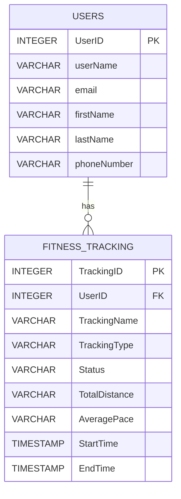

# Fitness Tracking Service

Spring Boot REST service for fitness tracking system. 
It uses an in-memory H2 database for data storage with JPA/Hibernate for ORM. 
It exposes endpoints for managing users and their fitness activities.

## ER Diagram and Data Model


## Prerequisites

- Java 17+ (or the project's configured JDK)
- Maven 3.6+
- Git (install on Windows from https://git-scm.com/download/win)
- (Optional) GitHub CLI `gh` for convenient repo creation

## Build and run
From the project root (where `pom.xml` lives):
### bash
mvn clean package
mvn spring-boot:run

The application starts at:http://localhost:8080

## How to create user and add activities? 
### Create a new user (POST `/fitness/createuser`)
Request:
json
POST http://localhost:8080/fitness/createuser
Headers:
- Content-Type: application/json

Payload (server will assign `userId` — omit or set to `null` if your API accepts it):
```json
{
  "userName": "testUser1",
  "email": "test123@gmail.com",
  "firstName": "Jon",
  "lastName": "Doe",
  "phoneNumber": "111-222-3333"
}
```

### Add activity for user \(POST `/fitness/addactivity`\)

Request:
POST http://localhost:8080/fitness/addactivity  
Headers:  
\- `Content-Type: application/json`

Payload (omit server-assigned ids; reference an existing user by id):
```json
{
  "trackingName": "Morning Run",
  "trackingType": "run",
  "status": "COMPLETED",
  "totalDistance": "5 km",
  "startTime": "2025-11-30T13:06:12.000Z",
  "endTime": "2025-11-30T13:08:12.000Z",
  "averagePace": "4 km/h",
  "user": { "userId": 1 }
}
```

H2 Database Console
Access the H2 console at: http://localhost:8080/h2-console
